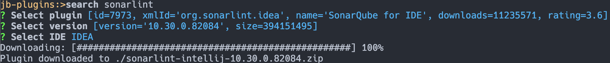

# JB-Plugins Downloader

A powerful, interactive Spring Shell command-line application designed to simplify the process of discovering and downloading plugins for JetBrains IDEs directly from your terminal.

## Features

*   **Interactive Search:** Search the JetBrains plugin repository by name.
*   **Guided Selection:** Navigate through plugins, versions, and compatible IDEs with easy-to-use menus.
*   **Direct Download:** Automatically downloads the selected plugin version for your chosen IDE.
*   **TAB Completion**: Use the TAB key to auto-complete commands and see available options, making the CLI intuitive and easy to use 
*   **History**: Stored in `~/jb-plugins.log`. Use `Up` and `Down` to scroll.

## Prerequisites

Before you can run `jb-plugins`, ensure you have the following installed on your system:
*   **Graal Java JDK 17 or higher**
*   **GraalVM requirements**

## Installation (Building from Source)

### Java

If you have the source code and want to build the project yourself:

1.  Ensure you have Maven installed.
2.  Clone the repository and navigate to its root directory.
3.  Run the Maven package command:
    ```bash
    ./mvnw clean package
    ```
4.  The executable JAR file will be created in the `target/` directory.
5. Run application `java -jar ./target/jb-plugins-0.0.1.jar`

### native-image

1. Build native image (see [Requirements](#prerequisites)): 
    ```bash
    ./mvnw clean native:compile -Pnative
    ```
2. Run application from target:
   ```bash
   ./target/jb-plugins
   ```

### Download (macOS ARM)

1. Download file `jb-plugins` from project root
2. Copy to `/opt/local/bin`:
    ```bash
   sudo mv jb-plugins /opt/local/bin/jb-plugins
    ```
3. Restart terminal
4. Use `jb-plugins`

## Usage

Once the application starts, you will see a prompt like this:
```
jb-plugins:>
```
This indicates the shell is active and ready to accept commands.

### Step-by-Step Guide

#### 1. Search for a Plugin
Use the `search` command followed by the name of the plugin you are looking for.

**Example:**
```
jb-plugins:>search sonarlint
```

#### 2. Select a Plugin from the List
The application will fetch and display a list of plugins matching your search term. You will be prompted to enter the number of your desired plugin.

**Example Output:**
```
SonarLint
IdeaSonar
SonarLink
SonarLint Integration
Other Sonar Plugin
```
Enter plugin (`Up`\ `Down` and press `Enter`).

#### 3. Select a Version
The application will then retrieve all available versions for the selected plugin. Choose the version you wish to download.

**Example Output:**
```
2024.1.1
2024.1.0
2023.3.3
...
```
Select version (`Up`\ `Down` and press `Enter`).

#### 4. Select a Compatible IDE
Finally, you will see a list of JetBrains IDEs that this plugin version supports. Select the IDE you want to download the plugin for.

**Example Output:**
```
IDEA
GOLAND
...
```
Select IDE (`Up`\ `Down` and press `Enter`).

#### 5. Download
After selecting the IDE, the application will begin downloading the plugin file (a `.zip` archive). A confirmation message will be displayed upon successful completion.

```
Downloading: [##################################################] 100%
Plugin downloaded to ./sonarlint-2024.1.1.zip
```

The plugin file will be saved in the current working directory from which you started the application.

## Getting Help

To see a list of all available commands at any time, type `help`:
```
jb-plugins:>help
```

To exit the application, use the `exit` or `quit` command:
```
jb-plugins:>exit
```

